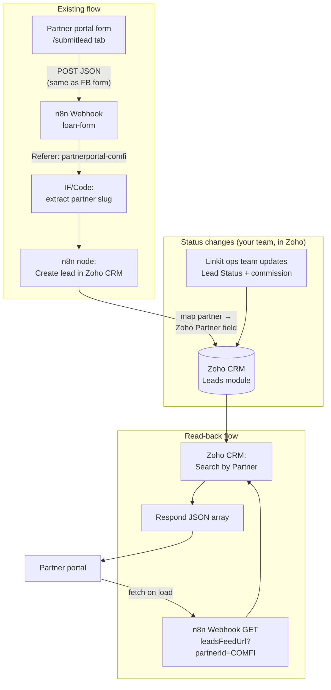

# Linkit Partner Portal

A partner-facing dashboard for the [Lets Link It](https://letslinkit.com/) referral network. Partners can submit SME leads, track them through the funnel (New → In Review → Approved / Rejected → Disbursed), and see their commissions (earned, paid out, balance due).

Plain HTML / CSS / JS — no build step.

## Running locally

Partner URLs use path-based routing (`/partnerportal-comfi/overview`), so use the included dev server (plain `python3 -m http.server` will 404 on those paths):

```bash
python3 serve.py
# then open http://localhost:8080/login.html
```

**Production:** add a rewrite so any `/partnerportal-*` path serves `index.html`. Example (nginx):

```nginx
location ~ ^/partnerportal- {
  try_files $uri /index.html;
}
```

## Partner login

1. Open `login.html`
2. Enter a Partner ID from the allowlist in [`partners.js`](partners.js) (e.g. `comfi`)
3. Redirects to `/partnerportal-comfi/overview`

Auth is a simple allowlist gate — no password. Add new partners to `PARTNERS` in `partners.js`:

```js
const PARTNERS = {
  comfi: { name: "Comfi", zohoId: "COMFI" },
  apex:  { name: "Apex Advisory", zohoId: "APEX" },
};
```

| URL path | Tab |
|---|---|
| `/partnerportal-comfi/overview` | Overview |
| `/partnerportal-comfi/submitlead` | Submit a Lead |
| `/partnerportal-comfi/leads` | My Leads |
| `/partnerportal-comfi/commissions` | Commissions |

## Tabs

| Tab | What's in it |
|---|---|
| **Overview** | Leads given, commissions earned, approved / rejected / disbursed counts, commissions paid out, balance due, a live pipeline funnel, and recent activity. |
| **Submit a Lead** | The referral form: lead name, company name, mobile number, VAT registered (Yes / No / I don't know), annual turnover. |
| **My Leads** | Full lead table with status badges, filter chips, and search. |
| **Commissions** | Total earned, paid out vs balance due, next settlement date, and a per-lead commission ledger. |

## Wiring it into your existing n8n → Zoho CRM flow

Integration points live in [`app.js`](app.js) (`CONFIG`) and [`partners.js`](partners.js) (partner allowlist):

```js
const CONFIG = {
  submitWebhookUrl: "",  // paste your n8n webhook URL locally — never commit it
  leadsFeedUrl: "",  // NEW n8n webhook that returns this partner's leads
};
```

### Lead submission (Referer-driven partner tagging)

The submit form POSTs the **same JSON body as the Facebook lead page** — no `partnerId` in the payload. n8n reads the browser **Referer** header to determine the partner:

- Facebook: Referer contains `fb-leads` → Lead Source = Facebook, no partner
- Partner portal: Referer contains `partnerportal-` → extract slug via regex → uppercase → Zoho Partner field (e.g. `comfi` → `COMFI`)
- Everything else → direct/unknown

Example Referer when a partner submits from the Submit tab:

```
http://localhost:8080/partnerportal-comfi/submitlead
```

The portal ensures the URL is `/partnerportal-{slug}/submitlead` before POSTing so the Referer is correct.

**n8n Code node example** (after your existing Webhook node):

```js
const referer = $input.first().headers?.referer || '';
let partner = '';
if (referer.includes('fb-leads')) {
  partner = '';
} else {
  const m = referer.match(/partnerportal-([A-Za-z0-9_-]+)/i);
  partner = m ? m[1].toUpperCase() : '';
}
return { partner, referer };
```

Map `partner` → your Zoho Partner custom field. Pattern is `partnerportal-` (no hyphen between "partner" and "portal").

POST body fields: `leadName, companyName, mobile, vatRegistered, turnover, submittedAt`.

### Leads read-back

- **`leadsFeedUrl`** — a second n8n workflow that reads leads back out of Zoho for one partner. While it's empty, the portal runs on demo data.
- Fetches with the uppercase Zoho ID: `leadsFeedUrl?partnerId=COMFI`

## Workflow: updating each lead's status per partner



### What you need to set up, step by step

1. **Zoho CRM (one-time):** add custom fields to Leads — `Partner` (or `Partner ID`), `Commission Amount`, `Commission Paid`. `Lead Status` picklist: New, In Review, Approved, Rejected, Disbursed.
2. **Existing n8n workflow:** after the Webhook node, add IF/Switch on Referer (`fb-leads` vs `partnerportal-` vs other). Map extracted partner slug (uppercase) to Zoho Partner field.
3. **New n8n workflow "Get Partner Leads":**
   - Webhook (GET), reads `partnerId` from query string.
   - Zoho CRM — Search where Partner equals `{{ $json.query.partnerId }}`.
   - Set/Code — shape records into `{ id, leadName, companyName, mobile, vat, turnover, status, commission, paidOut, submittedAt, disbursedAt }`.
   - Respond to Webhook — JSON array + CORS header.
4. **Portal:** paste the read-back webhook URL into `CONFIG.leadsFeedUrl`. Add partners to `partners.js` as you onboard them.

### How statuses actually change

Your team works in Zoho: when a lead progresses, update `Lead Status` (and commission fields on disbursal). The portal reads Zoho through n8n on every load.

**Optional push upgrade later:** Zoho workflow rule on status change → n8n webhook for WhatsApp/email notifications.
