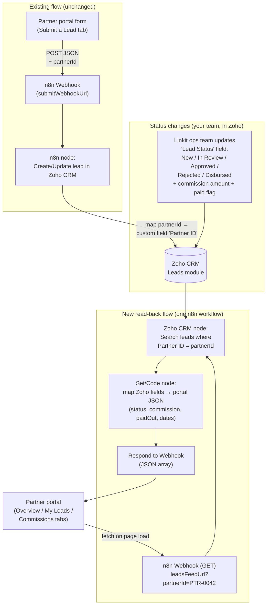

# Linkit Partner Portal

A partner-facing dashboard for the [Lets Link It](https://letslinkit.com/) referral network. Partners can submit SME leads, track them through the funnel (New → In Review → Approved / Rejected → Disbursed), and see their commissions (earned, paid out, balance due).

Plain HTML / CSS / JS — no build step. Just open `index.html` in a browser, or serve it:

```bash
python3 -m http.server 8080
# then open http://localhost:8080
```

## Tabs

| Tab | What's in it |
|---|---|
| **Overview** | Leads given, commissions earned, approved / rejected / disbursed counts, commissions paid out, balance due, a live pipeline funnel, and recent activity. |
| **Submit a Lead** | The referral form: lead name, company name, mobile number, VAT registered (Yes / No / I don't know), annual turnover. |
| **My Leads** | Full lead table with status badges, filter chips, and search. |
| **Commissions** | Total earned, paid out vs balance due, next settlement date, and a per-lead commission ledger. |

## Wiring it into your existing n8n → Zoho CRM flow

All integration points live at the top of `app.js` in the `CONFIG` object:

```js
const CONFIG = {
  partner: { id: "PTR-0042", name: "Apex Advisory" }, // per-partner identity
  submitWebhookUrl: "",  // your EXISTING n8n webhook (form → Zoho CRM)
  leadsFeedUrl: "",      // a NEW n8n webhook that returns this partner's leads
};
```

- **`submitWebhookUrl`** — paste your existing n8n production webhook URL here. The form POSTs JSON: `partnerId, partnerName, leadName, companyName, mobile, vatRegistered, turnover, submittedAt`. Your existing webhook → Zoho node keeps working as-is; the only change needed is mapping the new `partnerId` field to a custom field in Zoho (see below).
- **`leadsFeedUrl`** — a second, new n8n workflow that reads leads back out of Zoho for one partner (see workflow below). While it's empty, the portal runs on demo data.

To onboard a partner, you give them a copy/deployment of the portal with their `partner.id` set (or later, derive it from a login).

## Workflow: updating each lead's status per partner

Your current flow only writes **into** Zoho. To show live statuses in each partner's portal, you extend it with a partner tag and one read-back workflow — nothing existing gets touched:



### What you need to set up, step by step

1. **Zoho CRM (one-time):** add three custom fields to the Leads module — `Partner ID` (text), `Commission Amount` (currency), `Commission Paid` (checkbox). Your `Lead Status` picklist should carry the five stages: New, In Review, Approved, Rejected, Disbursed.
2. **Existing n8n workflow (one small edit):** in the Zoho node, map the incoming `partnerId` from the form payload to the new `Partner ID` field. That's the only change — everything else stays.
3. **New n8n workflow "Get Partner Leads":**
   - **Webhook node** (GET, respond via "Respond to Webhook"), reads `partnerId` from the query string.
   - **Zoho CRM node** — Search records in Leads where `Partner ID` equals `{{ $json.query.partnerId }}`.
   - **Set/Code node** — shape each record into `{ id, leadName, companyName, mobile, vat, turnover, status, commission, paidOut, submittedAt, disbursedAt }`.
   - **Respond to Webhook node** — return the JSON array. Enable CORS (`Access-Control-Allow-Origin`) in the webhook response headers so the browser can call it.
4. **Portal:** paste the new webhook URL into `CONFIG.leadsFeedUrl`. Done — every time a partner opens their portal, it pulls the latest statuses straight from Zoho, and all the dashboard numbers (approved, rejected, disbursed, commissions due) recalculate automatically.

### How statuses actually change

Your team works in Zoho exactly as they do today: when a lead progresses, they change `Lead Status` (and on disbursal, fill `Commission Amount`; after settlement, tick `Commission Paid`). No extra syncing step — the portal reads Zoho through n8n on every load, so it's always current.

**Optional push upgrade later:** add a Zoho *workflow rule* on "Lead Status changes" that calls another n8n webhook — useful for notifying the partner by WhatsApp/email the moment a lead is approved or disbursed. Not required for the portal itself.
